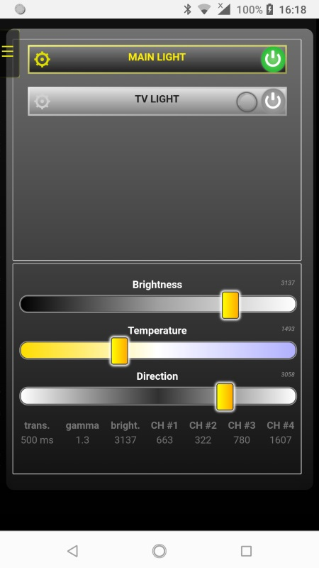

# ESPurna FORK
This is just a fork of the ESPurna project ([open original project](https://github.com/xoseperez/espurna)).

## FOCUS
It was focused on the H801 and Web-API.

Settings are modified, so it compiles on the H801 module and allows Web-Api control over GET and POST.

A Web-Interface was added (Web-App to control the lights). You can upload on your webserver or call it directly from the module (http://IPNUMBER/app)

<b>Controls multiple modules with 4 defined channels over 3 sliders:</b>
- Bottom LEDs: 2 strips: white and yellow
- Top LEDs: 2 strips: white and yellow
- Brightness slider: each module has a brightness
- Balance slider: the color (yellow or white) will change on every module at the same time
- Direction slider: each module can bright more on the upper or lower side

## How it works
Once you set it up (WiFi SSID and pass), you have to open the module over the IP (192.168.1.XXX) and get or set the ApiKey.

Then, you can open the app (http://92.168.1.XXX/app) and control the lights over this app. The app can also be installed on your phone by clicking: "add to home screen".

### App
- Firstly, you need to add a light: click on "EDIT MODE" in the menu and press "ADD LIGHT"
- After the page was reloaded, click again on "EDIT MODE", now you can press the gear on the left side of the button
- Set the IP and APIKey and save
- Now, you can power on/off the module and control 4 channels over 3 sliders (color temperature is a global variable).

## Changes over the fork
- To allow CORS, some http-headers was added
- Parameters was changed to work with the H801 module and Web-Api
- Workaround for the ESP8266 flickering problem with PWM on low values
- 4 channels can be changed or requested with a single REST (example: channels?value=000aaa888777 as the value length limit is 15 bytes)

## Known issues
- https does not work (H801 has not enough memory for the entire SSL-encryption library)
